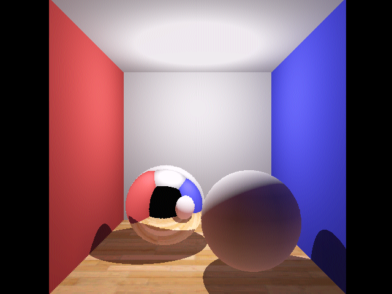

# Ray Tracing for the TI-84 CE

A ray tracing engine written in C++/ASM for the TI-84 CE. This engine is capable of 

- Scenes of arbitrary sphere and plane primitives
- Difuse and reflective shading
- Texture mapping
- Dithering
- Gamma correct rendering and HDR tone mapping
- Global illumination through radiosity

and can render the scene shown below (at standard resolution) in about 12 minutes.

Check out [this video](https://www.youtube.com/watch?v=rY413t5fArw) for more information and to see the renderer in action.

A sample scene rendered at double resolution.

## Try It Yourself

**Note:** Due to reliance on some eZ80 hardware instructions, this program can only be run on CE or later model calculators from the TI-84 family.

1. Download the binary [here](bin/DEMO.8xp).
2. Download the [CE Libraries](https://github.com/CE-Programming/libraries/releases/latest).
3. Load both onto your calculator using the [TI Connect™ CE software](https://education.ti.com/en/products/computer-software/ti-connect-ce-sw).
4. Run the ASM program either with `Asm(DEMO)` or your favorite graphical shell.
5. The renderer will take a few minutes to compute radiosity.
6. When the graphics have completed rendering (usually takes about 12 minutes) press any key to exit to the OS.

**Warning:** This program takes a while to complete, and once started cannot be interrupted until it is finished. Every once in a while, it can also freeze up. If for any reason you need to quit the program, **you will need to reset your calculator**, which will clear any unarchived data in RAM. Make sure you don't have anything unarchived that you wouldn't be willing to lose before running this program.

## Building Locally

1. Install the latest [CE C/C++ Toolchain](https://github.com/CE-Programming/toolchain/releases/latest).
2. Run the `make` command

---

Looking for the older [TI-BASIC version](https://github.com/TheScienceElf/TiBASIC-Raytracing), instead?

This was written using the [CE C/C++ Toolchain](https://github.com/CE-Programming/toolchain).

